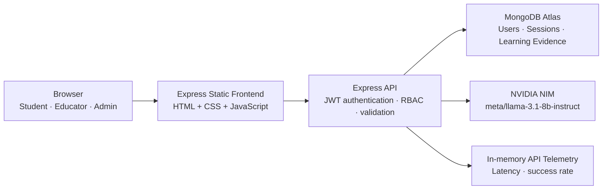
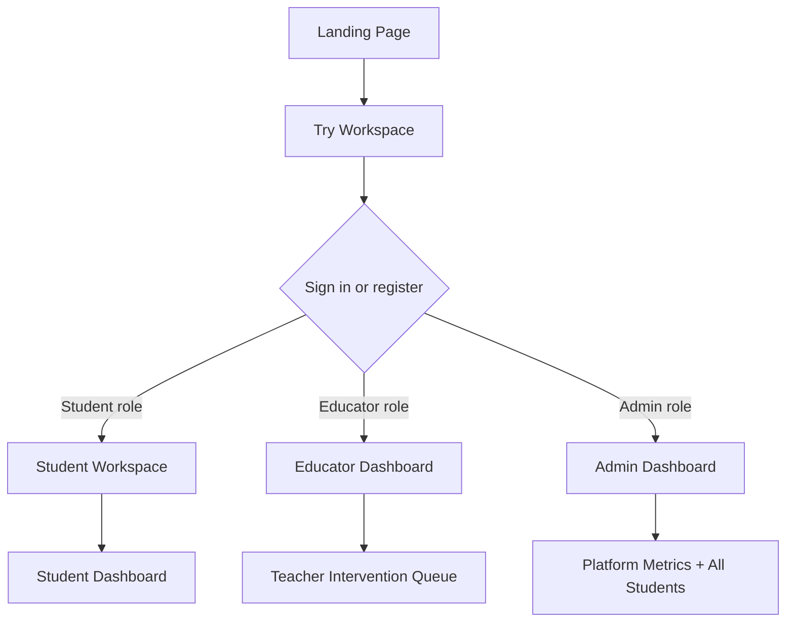
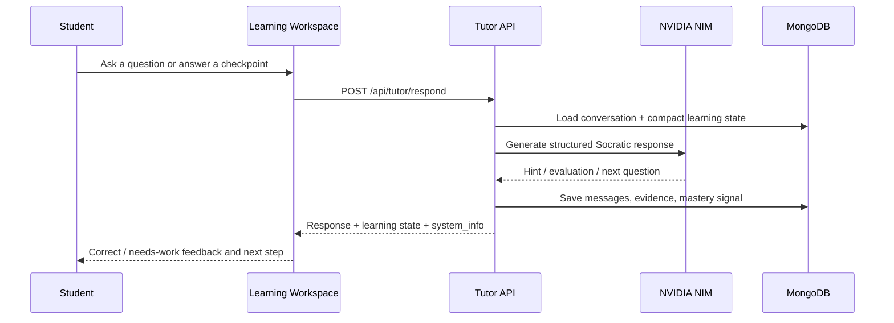
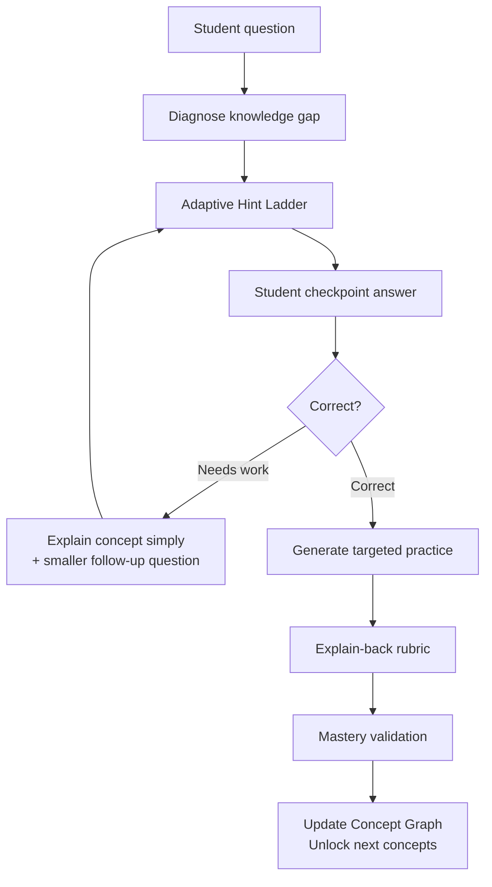
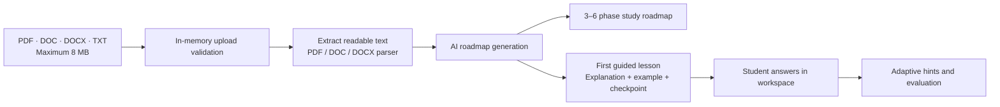
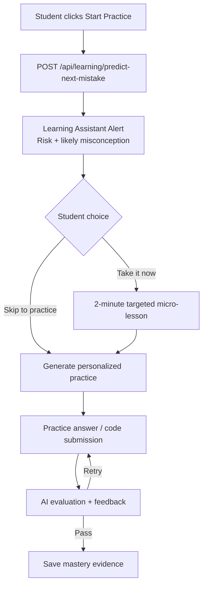
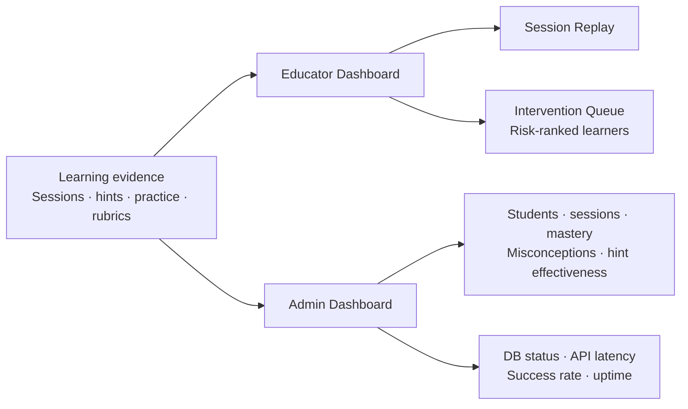
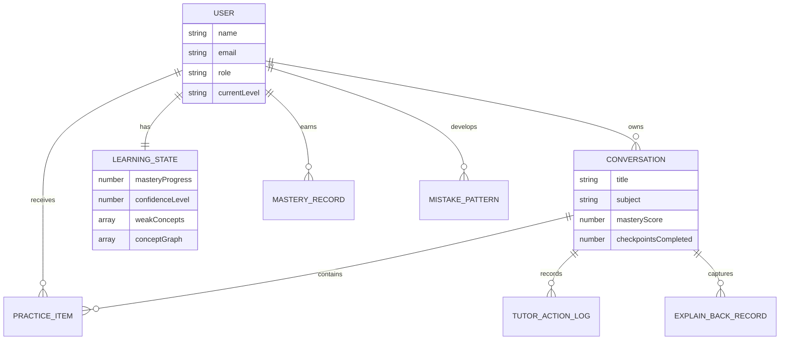
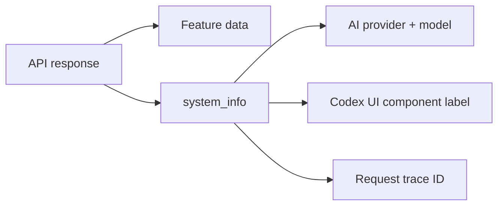

# Socratic Scaffold Architecture

Socratic Scaffold is an AI learning platform that guides learners through explanation, practice, feedback, and mastery evidence rather than immediately returning answers.

## System Overview

## Role-Based Entry Flow

## Student Tutoring Flow

## Personalized Learning Loop

## Syllabus Upload to Learning Roadmap

Uploaded source files are processed in memory and are not persisted by the application.

## Predictive Practice Workflow

## Educator and Admin Evidence Flow

## Main Data Models

## Transparency Metadata

Every API response includes a `system_info` object with the active AI provider/model, Codex-generated UI component label, and request trace ID. In the browser, append `?debug=1` to a page URL to print that metadata in the developer console.

